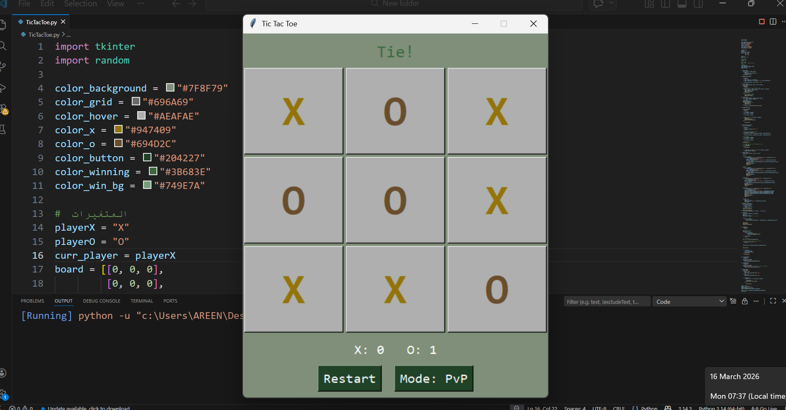
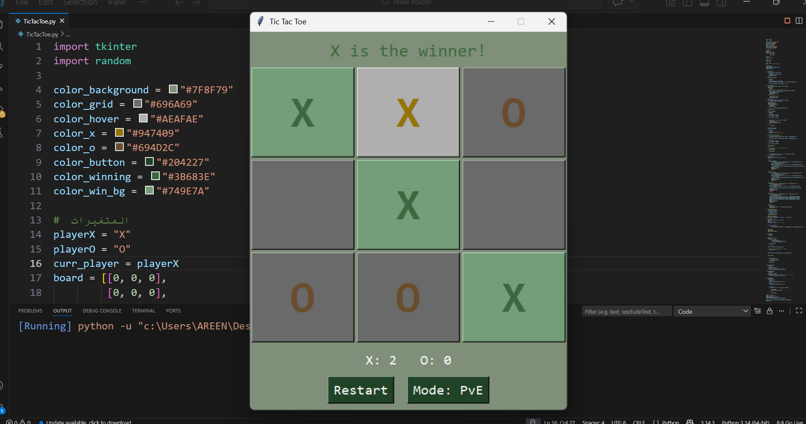
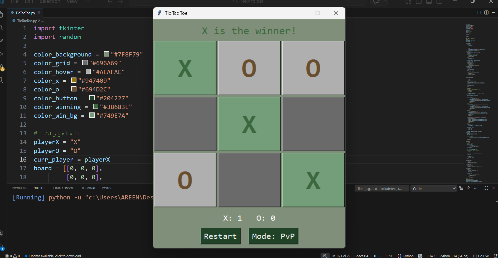

🎮 Tic Tac Toe (X-O) Game

A classic Tic Tac Toe game built with Python and Tkinter.
Challenge a friend or test your skills against the computer!
Features a clean interface, turn timer, scoreboard, and two game modes.

  
  
  

✨ Features

👥 Two Game Modes: Player vs Player (PvP) and Player vs Computer (PvE)

⏱️ Turn Timer: 7 seconds per move – race against the clock!

🏆 Scoreboard: Track wins for X and O

🎨 Clean UI: Hover effects, color-coded players, and winning highlights

🤖 Simple AI: Random move selection for the computer opponent (easy to improve)

🎯 How to Play

The game starts with X's turn.
Click on any empty cell to place your mark.
The timer counts down from 7 seconds – if it reaches zero, the turn switches automatically.
Get three in a row (horizontally, vertically, or diagonally) to win!
Use the Restart button to start a new game.
Toggle between PvP and PvE modes anytime.

🛠️ Technologies Used

Python 3 – Core logic

Tkinter – GUI framework

Random – For AI move selection

🚀 Coming Soon:

I will enhance the game by adding sound effects 🔊 
and making the AI smarter using the Minimax algorithm.🤖

📚 What I Learned from Building This Game:

I improved my skills in Python fundamentals: variables, conditionals, loops, and organizing code into small functions for better readability.

I also mastered building user interfaces with Tkinter, including layout design, binding button clicks to functions, and more.

I gained a deeper understanding of game logic and how to make the program's behavior change based on different modes (PvP/PvE).

These skills form a solid foundation for any future programming project, whether it’s a website, a desktop app, or even a more complex game.

What I cared about most was writing clean, well-organized code that’s easy to modify later.

📄 License
This project is licensed under the MIT License – see the LICENSE file for details.

🌟 Show some support

If you like this project, give it a ⭐ on GitHub!

